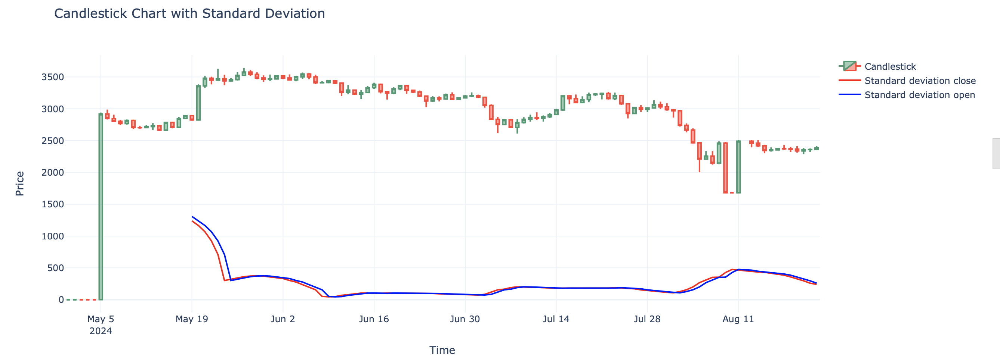

# Standard Deviation Indicator

This repository contains a Jupyter notebook (`standard_deviation.ipynb`) that demonstrates how to calculate the standard deviation for a dataset and visualize it using a candlestick chart with Plotly. This notebook leverages the HsTrader library, a powerful tool for financial data analysis and trading strategies.

## HsTrader Library

HsTrader is a Python library designed for financial data analysis and trading strategy development. It provides a wide range of tools for technical analysis, including standard deviation, moving averages, candlestick patterns, and other indicators. This notebook uses HsTrader to facilitate the calculation of the standard deviation and the visualization of financial data.

## What is the Standard Deviation Indicator?

The standard deviation indicator is a statistical measure that quantifies the amount of variation or dispersion in a set of data points. In financial markets, it is often used as a volatility indicator, helping traders understand the degree of price fluctuation over a given period. A higher standard deviation indicates greater volatility, while a lower standard deviation suggests more stable prices.

## Benefits of the Standard Deviation Indicator

- **Volatility Measurement:** The standard deviation helps in identifying the volatility of a security. High volatility often corresponds to larger price movements, which may present trading opportunities.
- **Risk Assessment:** Traders use standard deviation to assess the risk associated with a particular security. Higher deviation values indicate higher risk.
- **Trend Confirmation:** It can help confirm the strength of a trend. When combined with other indicators, it provides additional context to price movements.
- **Range Identification:** Standard deviation can also be used to identify price ranges where a security is likely to trade, offering insights into potential support and resistance levels.

## What Does the Standard Deviation Indicator Represent?

The standard deviation indicator represents the average amount by which the price of a security deviates from its mean over a specified period. For example, if a stock has a high standard deviation, its price is more spread out from the average, indicating higher volatility. This information is crucial for traders who want to understand market dynamics and make informed decisions based on the level of risk and volatility present in the market.
